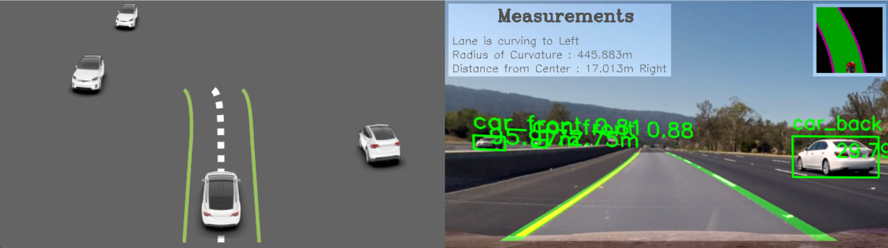
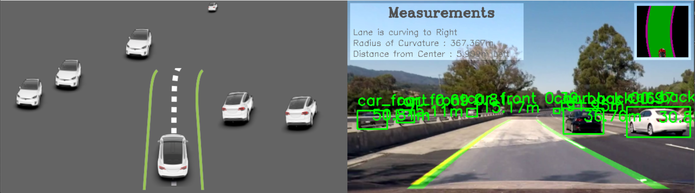
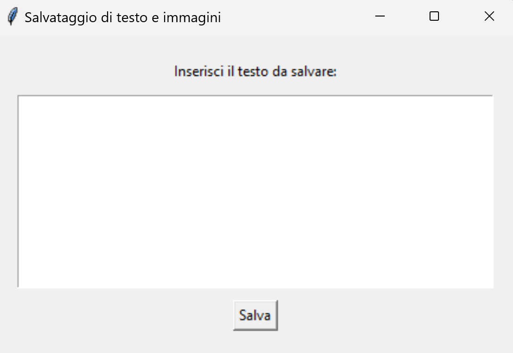

# self_driving_vision_and_reconstruction

## Description

The project consists of two main innovations: a lane detection system capable of analyzing and accurately recognizing road elements and curves, and a function for monitoring moving vehicles, including trucks, cars, and motorcycles. Through this combination, it is possible to define a precise representation of the road environment.

A distinctive element of the project is the introduction of a user interface that allows drivers to report anomalies, contributing to the continuous improvement of the system thanks to real feedback.

This work not only examines current technologies in autonomous driving but also lays the foundation for future developments, bringing the concept of autonomous driving closer to everyday reality and inviting the imagination and construction of the future of mobility.

## Features

- Lane detection and recognition of road elements
- Monitoring of moving vehicles (trucks, cars, motorcycles)
- Representation of the road environment
- User interface for reporting anomalies
- Modular code structure for easy expansion and integration


## Dataset
The weights for vehicle orientation recognition are already loaded in the code. 
You can view the data set used for recognizing the orientation of vehicles on. [DataSet](https://github.com/sekilab/VehicleOrientationDataset)

## Libraries

The project uses the following libraries:

- `PyTorch `
- `ultralytics` per YOLO
- `tkinter`
- `codecarbon`
- `matplotlib`
- `opencv-python`
- `numpy`


## Images


Example image of a driving scenario


Second example image of a driving scenario


User GUI


### Prerequisites

Make sure you have the following software and libraries installed:

- Python 3.x
- Required Python packages (listed in `requirements.txt`)

Additionally, download the dataset and model weights:

- Download the dataset from [this link](https://drive.google.com/drive/folders/1VkKwxuK8DOx7EsH9ZD5z_-nThg8BMyFE).
- Download the file `best.pt`, rename it to `yolov5_vehicle_oriented.pt`, and place it in the `yolo` directory.


### Installation Steps

1. Clone the repository:
   ```bash
   git clone https://github.com/luigiPP93/self_driving_vision_and_reconstruction.git
   ```
   ```bash
   cd self_driving_vision_and_reconstruction
   ```
    ```bash
   pip install -r requirements.txt
   ```
   ```bash
   python final_result.py
   ```
### License
```text
Copyright 2024 LuigiPP

   Licensed under the Apache License, Version 2.0 (the "License");
   you may not use this file except in compliance with the License.
   You may obtain a copy of the License at

       http://www.apache.org/licenses/LICENSE-2.0

   Unless required by applicable law or agreed to in writing, software
   distributed under the License is distributed on an "AS IS" BASIS,
   WITHOUT WARRANTIES OR CONDITIONS OF ANY KIND, either express or implied.
   See the License for the specific language governing permissions and
   limitations under the License.
```
   
